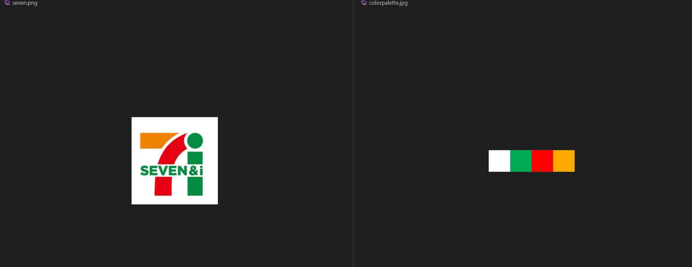

# 画像からカラーパレットを取得します

 

 ## 使い方

 ```
 pip install numpy opencv
 python calcColorPallete.py
 ```

 実行後、カラーパレットであるcolorpallete.jpgが生成されます。　　

 ## 注意
 ポスタライゼーション（階調変更）をしているので、元の画像の色とは若干異なっている場合があります。　　